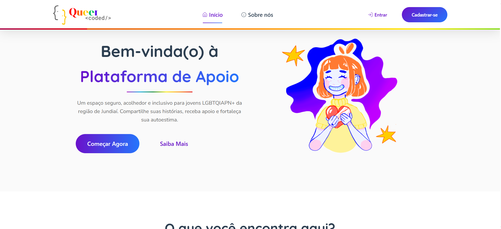

# Trabalho de Conclusão de Curso – Queer Coded 🏳️‍🌈💻
Bem-vindo(a) ao **TCC – Queer Coded**!  
Aqui você encontrará um Trabalho de Conclusão de Curso desenvolvido durante o **3º ano do Ensino Médio Integrado ao Técnico em Informática para Internet**, na **ETEC de Campo Limpo Paulista (ETECAMP)**.

## Título do Projeto
**Implementação de uma plataforma digital para auxiliar no apoio emocional de jovens LGBTQIAPN+ na região de Jundiaí**

---

## 👥 Equipe 
- **Aline Valentinne da Silva** – Parte escrita  
- **Jhenyffer Vieira de Oliveira** – Parte escrita  
- **Maria Isabel de Castro Nascimento** – Back-end e Front-end  

---

## ☕️ Descrição

As Escolas Técnicas Estaduais de São Paulo valorizam projetos que estimulem colaboração, criatividade e desenvolvimento profissional dos alunos. Dentro desse espírito, nasceu o **Queer Coded**, uma plataforma digital criada para **acolher, apoiar emocionalmente e oferecer um espaço de expressão a jovens LGBTQIAPN+ da região de Jundiaí**.

Durante o processo de pesquisa, percebemos que:
- Jovens LGBTQIAPN+ sofrem altos índices de discriminação  
- Muitos não possuem redes seguras de apoio  
- Há medo, autocensura e necessidade de ambientes anônimos  
- Plataformas existentes não atendem de forma adequada esse público  

Nosso objetivo:
👉 **Criar um espaço seguro, anônimo e acolhedor onde jovens possam desabafar, acompanhar seu humor, acessar conteúdos informativos e construir rede de apoio.**

O **Queer Coded** nasceu a partir de questionários e análises reais do público-alvo — tudo isso para criar uma plataforma que realmente atenda às necessidades desse grupo.

---

## 🎞️ Algumas imagens para demonstrar o site
*(Adicione seus prints na pasta Imagens_Readme)*

```

```

---

## 🖥️ Linguagens usadas no website
- **HTML** – Versão 5  
- **CSS** – Versão 3  
- **JavaScript** – ES6+  
- **React.js** – 2025  
- **MySQL** – Oracle 2025  

### Ferramentas auxiliares:
- VS Code  
- MySQL  
- XAMPP  
- Figma  
- Google Forms  
- Excel  

---

## ✔️ Etapas de construção do TCC
- Definição do tema e defesa  
- Pesquisa bibliográfica  
- Aplicação de questionário  
- Análise quantitativa e qualitativa  
- Desenvolvimento da identidade visual  
- Modelagem do sistema  
- Desenvolvimento do site  
- Testes  
- Escrita do artigo  
- Apresentação à banca  

---

# 🧰 Como executar o projeto

## 🖥️ Executando o website

### Instalar as dependências
1. Baixe o Visual Studio Code:  
https://code.visualstudio.com/

2. Instale o XAMPP:  
https://www.apachefriends.org/pt_br/download.html

---

### Carregar a base de dados

1. Faça download do arquivo **bd.sql**, localizado na pasta `/database`  
2. Abra o **XAMPP**  
3. Inicie **Apache** e **MySQL**  
4. No MySQL, clique em **Admin**  
5. Você será redirecionado ao phpMyAdmin:  
   👉 http://localhost/phpmyadmin/  
6. No menu à esquerda, clique em **Novo**  
7. Crie o banco de dados com o nome **bd** *(exatamente assim)*  
8. Vá até a aba **Importar**  
9. Clique em **Escolher arquivo**  
10. Selecione o arquivo **bd.sql**  
11. Role até o final e clique em **Importar**  
12. Banco carregado com sucesso! 🎉  

---

### 🚀 Iniciar o site

1. Faça o download dos arquivos da pasta **src**  
2. Abra a **pasta raiz do projeto** no explorador de arquivos  
3. Abra o **VS Code**  
   - Vá em **File > Open Folder**  
   - Selecione a pasta raiz do projeto  
4. Abra **dois terminais** no VS Code:  
   - Terminal → New Terminal  
   - Clique na setinha → Split Terminal  
   - Certifique-se de que ambos estão usando **CMD**  

---

### ▶️ Backend
No primeiro terminal:

```
cd backend
node app.js
```

O servidor será iniciado.

---

### 🌐 Frontend
No segundo terminal:

```
cd frontend
npm install
npm run dev
```

Um link aparecerá, normalmente:

```
http://localhost:5173/
```

Segure o Ctrl e clique no link.

*** OBS: Todos os acessos dos usuários cadastrados estão no arquivo users.txt na pasta /database junto com o arquivo do banco de dados

---

## ⌨️🖱️ Como citar este trabalho
DA SILVA, Aline Valentinne; OLIVEIRA, Jhenyffer Vieira de; NASCIMENTO, Maria Isabel de Castro. **Implementação de uma plataforma digital para auxiliar no apoio emocional de jovens LGBTQIAPN+ na região de Jundiaí**. 2025.

---

## 📬 Contato
Em caso de dúvidas entre em contato!
- alinevalentinne2@gmail.com  
- jhenny.oliveira2009@gmail.com
- mariaisabeldecastr0015@gmail.com

---

